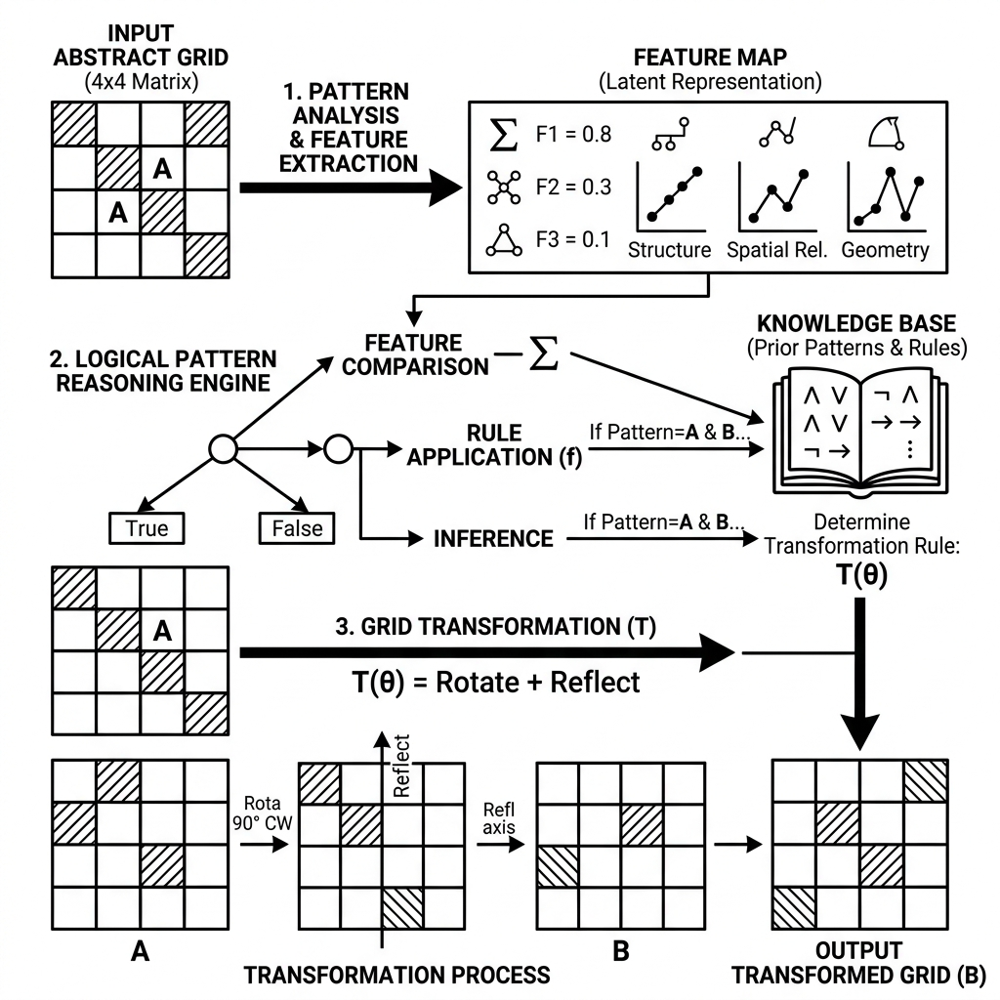

# ARC Prize 2024 — Human-Calibrated Problems

 

> **Host:** [``ARC Prize Foundation``]  
> **Platform Link:** [Kaggle Competition](https://www.kaggle.com/competitions/arc-prize-2024)  
> **Dataset Link:** [Kaggle Dataset](https://www.kaggle.com/competitions/arc-prize-2024/data)  
> **Domain:** ``Abstract Reasoning & Logical AI``

## Overview

This is my workspace for the ARC Prize 2024. The goal here was to tackle abstract reasoning puzzles that require actual logic rather than just pattern matching. It was a really fun challenge trying to solve visual grids using Python!

## Workflow Pipeline

## Notebook Architecture

### Preprocessing & EDA

| Notebook / Script | Type | Versions | Average Size | Core Stack / Techniques |
| :--- | :--- | :--- | :--- | :--- |
| [EDA_and_Visualization](./Preprocessing%20%26%20EDA/EDA_and_Visualization.ipynb) | Single Notebook | v1 | 238 KB | PyTorch |
| **EDA_and_Visualization_2** | Multi-Version Script | [v1](./Preprocessing%20%26%20EDA/EDA_and_Visualization_2/v1.ipynb), [v2](./Preprocessing%20%26%20EDA/EDA_and_Visualization_2/v2.ipynb) | 72 KB | Python |

### Training

| Notebook / Script | Type | Versions | Average Size | Core Stack / Techniques |
| :--- | :--- | :--- | :--- | :--- |
| [Training](./Training/Training.ipynb) | Single Notebook | v1 | 379 KB | PyTorch |

## Navigation Guidelines

> **Stage Guidelines**
>
> 1. **EDA & Preprocessing**: Verify data loaders and inspect class distributions before model design.
> 2. **Training & Validation**: Check training runs, loss curves, and model validation scores to evaluate performance.
> 3. **Inference & Ensembling**: Run predictions on testing files and verify submission formatting.

---

> "We dance round in a ring and suppose, but the Secret sits in the middle and knows."
>
> — **Vigneshwaran S**
