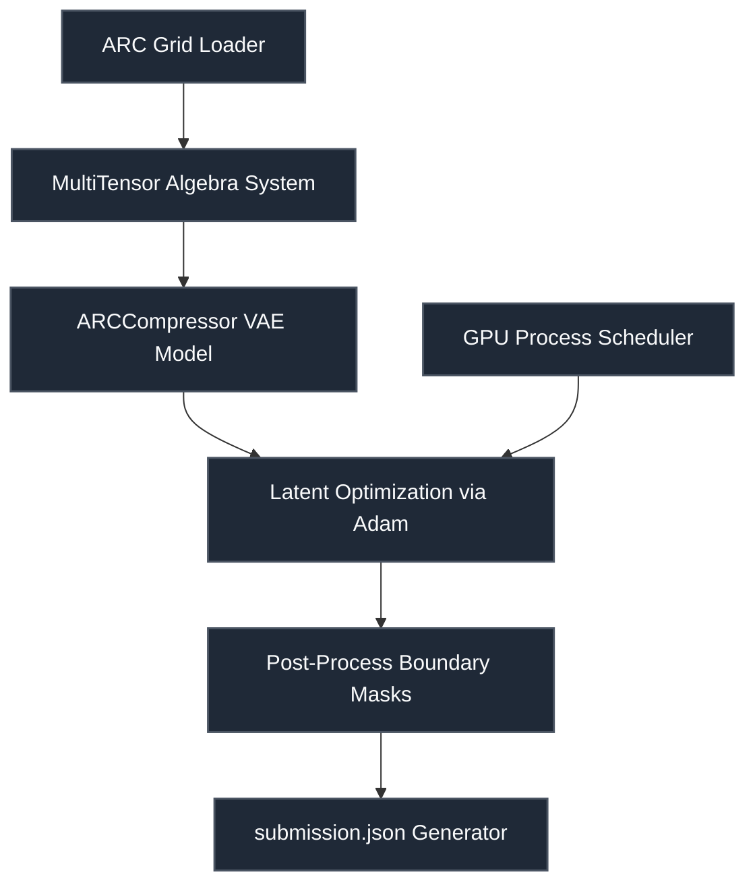

# ARC Prize 2024 — Human-Calibrated Problems

 

> **Host:** [`ARC Prize Foundation`]  
> **Platform Link:** [Kaggle Competition](https://www.kaggle.com/competitions/arc-prize-2024)  
> **Dataset Link:** [Kaggle Dataset](https://www.kaggle.com/competitions/arc-prize-2024/data)  
> **Domain:** `Abstract Reasoning & Logical AI`

## Overview

This repository contains the developmental workspace and notebooks for the **ARC Prize 2024 — Human-Calibrated Problems** project. The primary focus of this project is in the domain of **Abstract Reasoning & Logical AI** on ARC Prize Foundation. The codebase represents an iterative implementation of machine learning pipelines, structured to process datasets, train models, and validate predictions.

### Project Context

Getting all the task names, setting defaults and constants.

### Technical Methodology & Implementation

The codebase features a total of 16 cells across 4 notebook(s). The system implements several key architectural elements:
- **Core Classes**: Custom object-oriented structures are defined to manage state and logic, including: `ARCCompressor`, `ARCGridFormatter`, `Initializer`, `LLMARCSolver`, `LLMConfig`, `Logger`.
- **Key Algorithms & Utilities**: Procedural helpers and utilities facilitate operations, notably: `__getitem__`, `__init__`, `__iter__`, `__setitem__`, `_best_slice_point`, `_collect_problem_shapes`, `_compute_mask`, `_construct_multitensor_system`.
- **Training & Optimization**: Includes optimization via Adam, parallel multi-processing scheduling.

## System Architecture

## Notebook Architecture

### Preprocessing & EDA

| Notebook / Script | Type | Versions | Average Size | Core Stack / Techniques |
| :--- | :--- | :--- | :--- | :--- |
| [EDA_and_Visualization](./Preprocessing%20%26%20EDA/EDA_and_Visualization.ipynb) | Single Notebook | v1 | 238 KB | PyTorch |
| **EDA_and_Visualization_2** | Multi-Version Script | [v1](./Preprocessing%20%26%20EDA/EDA_and_Visualization_2/v1.ipynb), [v2](./Preprocessing%20%26%20EDA/EDA_and_Visualization_2/v2.ipynb) | 72 KB | Python |

### Training

| Notebook / Script | Type | Versions | Average Size | Core Stack / Techniques |
| :--- | :--- | :--- | :--- | :--- |
| [Training](./Training/Training.ipynb) | Single Notebook | v1 | 379 KB | PyTorch |

## Navigation Guidelines

> **Stage Guidelines**
>
- **EDA & Preprocessing**: Verify data loaders and inspect class distributions before model design.
- **Training & Validation**: Check training runs, loss curves, and model validation scores to evaluate performance.
- **Inference & Ensembling**: Run predictions on testing files and verify submission formatting.

---

> "We dance round in a ring and suppose, but the Secret sits in the middle and knows."
>
> — **Vigneshwaran S**
